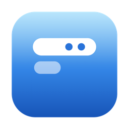

<div align="center">
    
    <h1>FloeBar</h1>
    <p><b>A lightweight, native-feeling menu bar manager for macOS.</b></p>
</div>

<div align="center">


-orange?style=flat-square)


</div>

FloeBar hides the menu bar icons you don't need and shows them again when you
want them — by hover, click, scroll, or a dedicated bar below the menu bar. It
stays small, quiet, and out of the way, and it **remembers where every icon
belongs** so your layout doesn't drift over time.

> [!IMPORTANT]
> **FloeBar is an independent derivative of [Ice](https://github.com/jordanbaird/Ice) by Jordan Baird**, built on Ice `0.12.0`.
> It is **not affiliated with or endorsed by** the upstream Ice project. Please
> file FloeBar issues here rather than on the Ice tracker. FloeBar keeps Ice's
> [GPL-3.0 license](LICENSE); see [NOTICE.md](NOTICE.md) for full attribution.

Maintained by **Evan Zhu**.

## Why FloeBar

- **System-friendly — no bleeding-edge OS required.** FloeBar runs on
  **macOS 14 (Sonoma) and later**, including macOS 15 and 26. You do **not** need
  to be on the newest macOS to use it, and it doesn't chase OS-only APIs that
  lock out perfectly good machines.
- **Universal binary.** One build runs natively on both Apple Silicon and Intel.
- **Coexists with Ice.** FloeBar ships under its own bundle identifier, so you
  can keep an existing Ice install side by side while you try it.
- **Light on resources.** Idle CPU and memory were a primary focus (see below).

## Built on Ice — what FloeBar adds on top of 0.12.0

FloeBar started from Ice `0.12.0` and focuses on being smaller, steadier, and
more predictable for everyday use. On top of that baseline it adds or changes:

### Reliability

- **Per-item section memory.** Each icon's *hidden* / *always-hidden*
  assignment is persisted per app and actively restored, so categories survive
  relaunches, reboots, and macOS shuffling icons around — instead of being
  re-guessed from on-screen position every launch.
- **Correct temporary-show reinsertion.** Fixed an off-by-one that could drop a
  temporarily shown item back into the wrong spot.

### Performance & footprint

- **Screenshot buffer leak fixed** in the menu bar capture path.
- **Coalesced hover work** — a single generation-guarded task instead of one per
  mouse move.
- **Bounded image cache** that evicts icons for apps that have quit.
- **Lower idle polling** — the color sampler only runs while the bar is visible,
  and overlay panels share a single low-frequency refresh with one window
  snapshot per tick.

### A simpler, more native surface

- **Removed the menu bar item search** feature and its fuzzy-matching
  dependency — it kept a resident panel and library in memory for a feature many
  people never use.
- **Trimmed the right-click menu** to just Settings and Quit.
- **Adjustable Floe Bar background opacity** from 0–100%, while keeping menu
  bar icons crisp and fully opaque. The bar stays visible while you drag the
  slider so changes can be previewed live.
- **Brand-matched menu bar icon.** New installations use the FloeBar App Icon's
  background-free symbol by default; other icon choices remain available.
- **Refreshed settings UI** — macOS semantic typography, continuous-corner
  cards, lighter section titles, and restrained SF Symbols with native spacing.
- **Redesigned app icon** in the Apple squircle style.

### Localization

- **English and Simplified Chinese**, following the macOS system language
  automatically. Chinese is hand-translated and uses the localized brand name
  **浮岛**, not machine output.

### Distribution & privacy

- **Independent in-app updates.** FloeBar uses its own Sparkle feed hosted on
  GitHub Pages, with EdDSA-signed archives from GitHub Releases. It never uses
  the upstream Ice feed or installs official Ice builds over FloeBar.
- **One-time import.** On first launch, if an Ice install is present, FloeBar
  imports your existing settings and menu bar layout once — then leaves your
  FloeBar preferences alone.

## Features

### Menu bar item management

- [x] Hide menu bar items
- [x] "Always-hidden" menu bar section
- [x] Remember each item's section across relaunches and reboots
- [x] Reveal hidden items on hover, click, scroll, or swipe
- [x] Automatically rehide items
- [x] Hide application menus when they overlap shown items
- [x] Drag-and-drop layout editor
- [x] Show hidden items in a separate bar (handy for notch MacBooks)
- [x] Adjust the Floe Bar background opacity with live preview

### Menu bar appearance

- [x] Tint (solid and gradient)
- [x] Shadow
- [x] Border
- [x] Custom shapes (rounded and/or split)

### Hotkeys & other

- [x] Toggle individual menu bar sections
- [x] Enable/disable the Floe Bar
- [x] Show/hide section divider icons
- [x] Toggle application menus
- [x] Launch at login
- [x] Check for and install EdDSA-verified updates in the app

## Install

### Download a release

Grab the latest build from the [Releases page](https://github.com/EvanZhuYF/FloeBar/releases/latest):

- **`FloeBar-1.0.3-universal.zip`** — runs on any supported Mac (Apple Silicon + Intel). Pick this if unsure.
- **`FloeBar-1.0.3-arm64.zip`** — smaller, Apple Silicon only.

Unzip it and move `FloeBar.app` into `/Applications`. The release builds are
ad-hoc signed (not notarized), so on first launch macOS may block the app —
right-click it and choose **Open**, or run:

```sh
xattr -dr com.apple.quarantine /Applications/FloeBar.app
```

You can verify a download against `SHA256SUMS.txt` from the release:

```sh
shasum -a 256 -c SHA256SUMS.txt
```

FloeBar 1.0.0 did not include the FloeBar update feed. Install 1.0.1 or later
manually once; subsequent releases can be installed from **Settings → Updates**.

### Build from source

FloeBar is a standard Xcode project with no manual dependency setup — Swift
Package Manager resolves everything on first build.

```sh
git clone https://github.com/EvanZhuYF/FloeBar.git
cd FloeBar
open FloeBar.xcodeproj
```

Then build and run the **FloeBar** scheme in Xcode. Requires macOS 14+ and
a recent Xcode.

Because FloeBar uses its own bundle identifier, macOS will ask you to grant
**Accessibility** and **Screen Recording** permission on first launch. These are
what let it read the menu bar layout and move items; no data leaves your Mac.

## Credits

FloeBar is based on [Ice](https://github.com/jordanbaird/Ice) by Jordan Baird,
licensed under GPL-3.0. Huge thanks to Jordan and everyone who contributed to
Ice — FloeBar exists because Ice is such a solid foundation.

## License

FloeBar is released under the [GPL-3.0 license](LICENSE), the same license as
Ice. See [NOTICE.md](NOTICE.md) for attribution and a summary of modifications.
